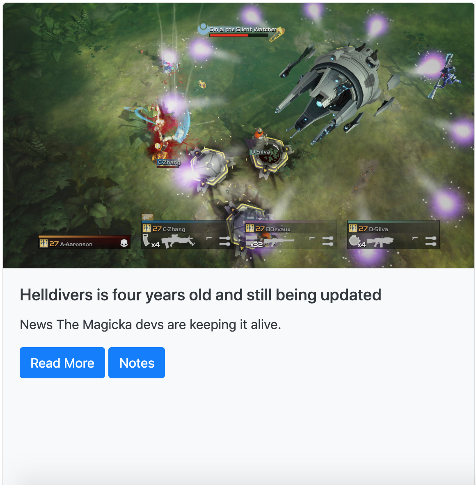

# Mongo-Scrape

This website scrapes articles from the PC Gamer website and appends them to the page where users can even add personal notes to each article. To scrape the site the user must hit the scrape articles link tag and to view the JSON data of all the articles click the API Articles tag. If you wish to clear the articles below that you scraped you can use the clear articles button then try scraping again to see if any new articles popped up. The clear articles button will not remove the articles from our MongoDB but simply clear the div where they are appended to. So when you scrape the site again our scraper will not duplicate scrape because we require in our articles model that our titles must be unique then all old articles and any new ones will append to the page. Also every article has a read more button that links to the actual PC Gamer article itself.

# Site Images

# Example of Article

# Link to Deployed Site (Heroku)
[Heroku](https://shielded-badlands-26864.herokuapp.com/)

# Built With
- HTML
- CSS
- Javascript
- Node
- NPM
- MongoDB

# Node Package's Used
- Express
- Mongoose
- Express-Handlebars
- Cheerio
- Axios

# Databases
- MongoDB
